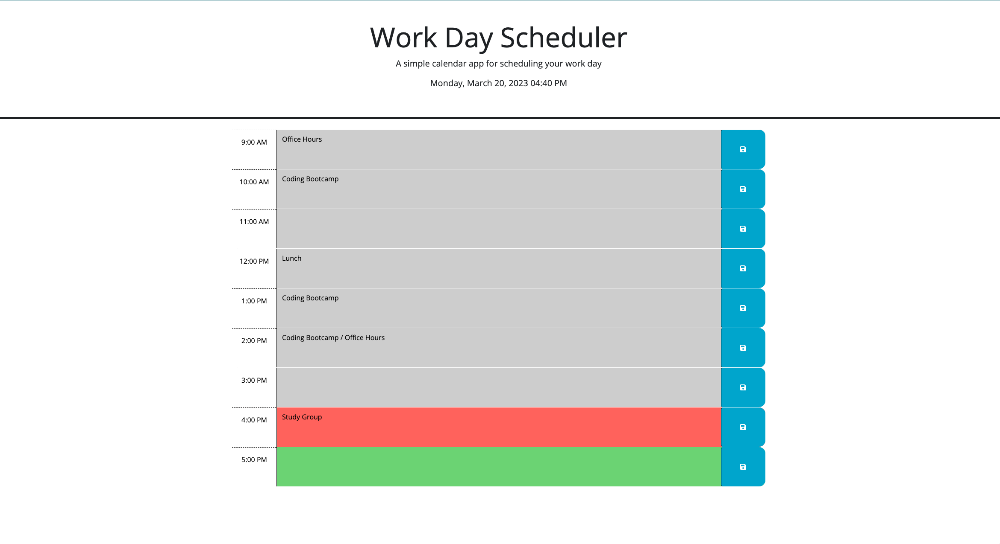
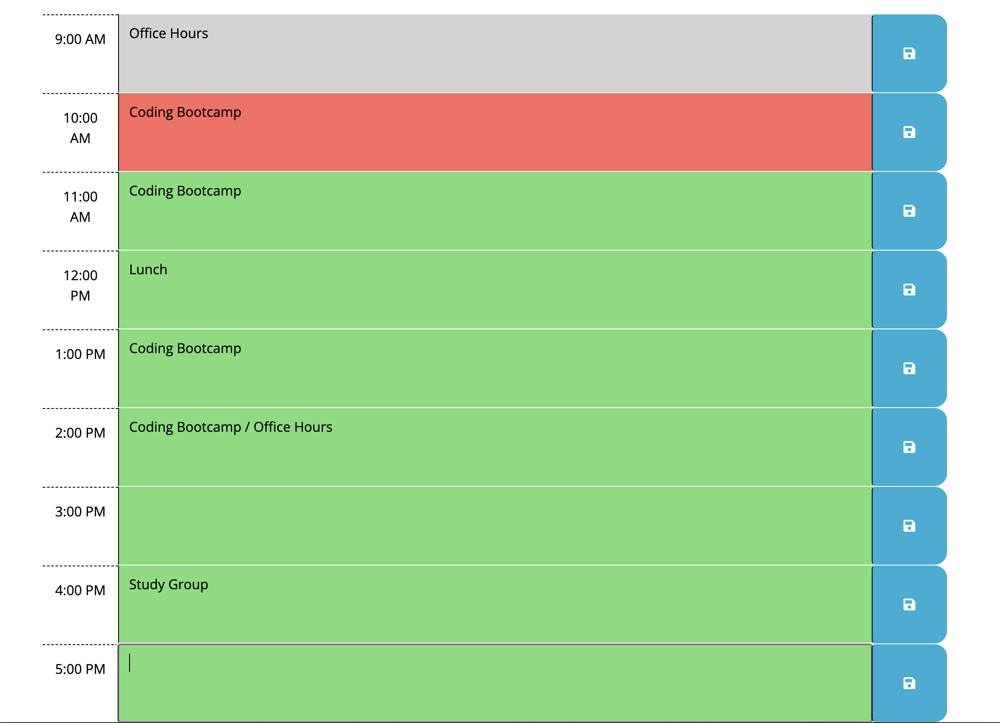
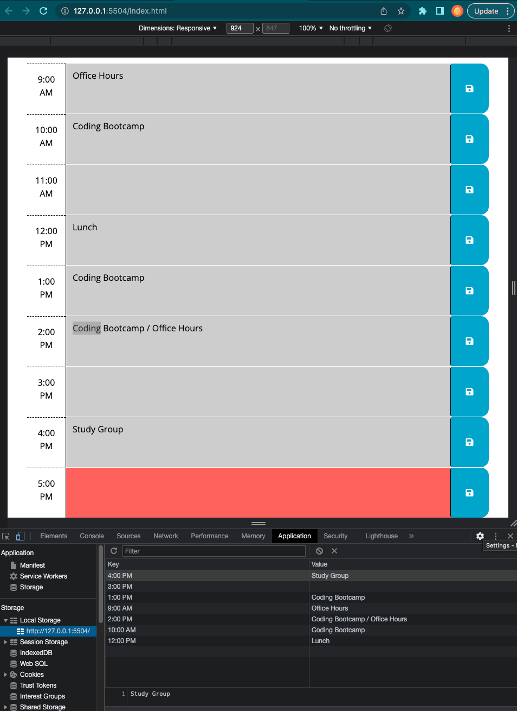

# Challenge5-WorkdayScheduler

## Description

In homework 5 of the Full-Stack Bootcamp, students were challenged to create a Work Day Scheduler.  This work day scheduler is a simple calendar app for scheduling user tasks between the hours of 9:00 AM to 5:00 PM.  The motivation for this project was to utilize skills learned about third-party APIs and create a functioning scheduler to keep track of our daily tasks.  This project was built for anyone that needs help with organization of tasks and events throughout their "working" hours.  The workday scheduler was created by applying jQuery concepts of creating new elements and appending them to the page as well as calling functions and setting an event listener.This app solves the problem of organization by being a catch-all in remembering the user's tasks by storing them in local storage for them to come back to.  The user can then refer back to this scheduler to see the current time of day as well as what event/task is next on their day's schedule.  This allows the user, or myself to see our day as a whole so we can arrange and see what is priority for each day.  The live day, date, and time are retrieved via dayjs.  By completing this challenege, I learned to further apply and practice my learned jQuery & JavaScript skills to create a practical app that can be widely used.  

Link to deployed app: 
https://p-trish.github.io/Challenge5-WorkdayScheduler/

## Installation

N/A

## Usage

To use the work day scheduler, the user can type in their task in any row and save it by clicking the blue save icon button on the right-hand side.  The task corresponds with the hour of the day on the left-hand side.  When the current time has passed, that hour block will turn grey.  The current hour block, is indicated by the color red.  Future time blocks are represented by the color green.  

The below photo simulates an example of what the workday may look like at 10:00 AM.  

Local storage is used to save the user input as seen in the ChromeDevTools Inspector in the photo below:

## Credits

I'd like to credit my friends Ryan and Zack who are currently web developers in San Diego, CA and Los Angeles, CA.  They each were able to help me walk through the step-by-step of coming up with my code as well as testing to make sure it ran correctly.  

## License

N/A

## Features

This app utilizes dayjs for live day, date, and time.  

